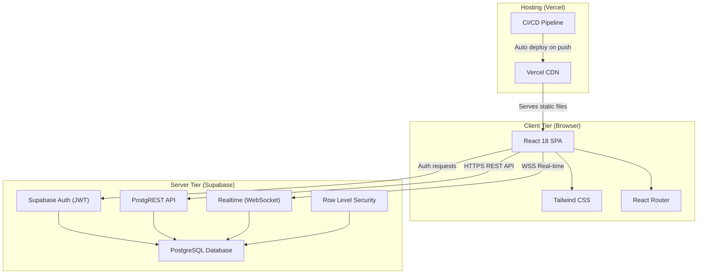
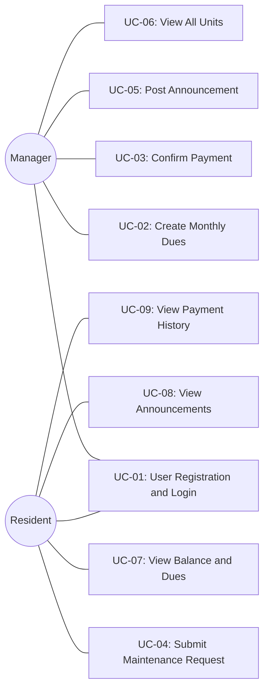

# HomeLink - Software Architecture Document

---

## Executive Summary

HomeLink is a web-based property management platform designed to digitize and streamline the administrative operations of residential buildings. This document presents the complete software architecture of HomeLink, following the **4+1 View Model** proposed by Philippe Kruchten (1995).

The system adopts a **client-server architecture** with a **React 18 Single Page Application (SPA)** as the frontend and **Supabase** as the Backend-as-a-Service (BaaS), providing PostgreSQL database, JWT-based authentication, auto-generated REST API, and real-time WebSocket subscriptions. This architectural choice enables rapid development, minimal backend code, built-in security through Row Level Security (RLS), and zero-cost deployment on free-tier cloud services (Vercel + Supabase).

Key architectural highlights:

- **Two-tier client-server** architecture with clear separation of concerns
- **Real-time data synchronization** via Supabase Realtime WebSocket subscriptions
- **Role-based access control** enforced at both UI and database levels
- **Stateless authentication** using JWT tokens with automatic session refresh
- **Responsive, mobile-first** user interface using Tailwind CSS utility classes
- **Zero-cost deployment** leveraging Vercel (frontend) and Supabase (backend) free tiers

This document is intended for developers, stakeholders, course instructors, and future maintainers who need to understand the architectural decisions, trade-offs, and implementation structure of the HomeLink system.

---

## Title Page

| | |
|---|---|
| **Project Name** | HomeLink - Property Management System |
| **Document Title** | Software Architecture Document (SAD) |
| **Version** | 1.0 |
| **Date** | April 2026 |
| **Course** | SWE332 - Software Architecture |
| **Architecture Model** | 4+1 View Model (Kruchten, 1995) |

### Team Members

| Name | Student ID | Responsibility |
|------|-----------|----------------|
| Bager Diren Karakoyun | 210513250 | Project Lead, README, Sections 1-3, Section 9 (Scenarios) |
| Abdalrahman Mazen Ahmad Nashbat | 230513079 | Section 5 - Logical View (Class Diagram) |
| Deo Gratias Kipioka Mutipula | 220513571 | Section 6 - Process View (Sequence + Activity Diagrams) |
| Maryama Said Mohamoud | 210513248 | Sections 7-8 - Development + Physical Views |
| Alawi Khaled Alhamed | 230513621 | Section 4 (Goals), Sections 10-11 (Size/Performance, Quality), Appendices |

---

## Change History

| Version | Date | Author | Description |
|---------|------|--------|-------------|
| 0.1 | 2026-04-05 | Bager Diren Karakoyun | Initial document structure, Title Page, TOC, List of Figures |
| 0.2 | 2026-04-05 | Bager Diren Karakoyun | Added Scope (Section 1) and References (Section 2) |
| 0.3 | 2026-04-05 | Bager Diren Karakoyun | Added Software Architecture overview (Section 3) |
| 0.4 | 2026-04-06 | Bager Diren Karakoyun | Added Use Case Diagram with 2 actors and 9 use cases |
| 0.5 | 2026-04-06 | Bager Diren Karakoyun | Added 5 detailed use case descriptions (UC-01 through UC-05) |
| 0.6 | 2026-04-06 | Bager Diren Karakoyun | Improved Section 3 with architecture diagram, technology mapping, and routing |

---

## Table of Contents

1. [Scope](#1-scope)
2. [References](#2-references)
3. [Software Architecture](#3-software-architecture)
4. [Architectural Goals and Constraints](#4-architectural-goals-and-constraints)
5. [Logical View](#5-logical-view)
6. [Process View](#6-process-view)
7. [Development View](#7-development-view)
8. [Physical View](#8-physical-view)
9. [Scenarios](#9-scenarios)
10. [Size and Performance](#10-size-and-performance)
11. [Quality](#11-quality)
12. [Appendices](#12-appendices)

---

## List of Figures

| Figure # | Title | Section |
|----------|-------|---------|
| Figure 3.1 | High-Level System Architecture Diagram | Section 3.3 |
| Figure 5.1 | Class Diagram | Section 5.2 |
| Figure 6.1 | Sequence Diagram - User Login | Section 6.2 |
| Figure 6.2 | Sequence Diagram - Add Dues | Section 6.3 |
| Figure 6.3 | Sequence Diagram - Maintenance Request | Section 6.4 |
| Figure 6.4 | Activity Diagram - Payment Flow | Section 6.5 |
| Figure 7.1 | Component Diagram | Section 7.3 |
| Figure 8.1 | Deployment Diagram | Section 8.1 |
| Figure 9.1 | Use Case Diagram | Section 9.1 |

---

## 1. Scope

### 1.1 Project Description

HomeLink is a web-based property management system designed to digitize and streamline the administrative operations of residential buildings. The platform serves as a centralized digital bridge between building managers and residents, replacing traditional paper-based or informal communication methods with a modern, real-time web application.

The system addresses the following core problems in residential building management:

- **Lack of transparency** in monthly dues and payment tracking
- **Inefficient communication** between managers and residents for announcements and requests
- **No centralized system** for submitting and tracking maintenance requests
- **Manual record-keeping** leading to errors in payment confirmations and balance calculations

HomeLink solves these problems by providing role-based dashboards for managers and residents, automated balance calculations, real-time data synchronization, and a complete audit trail for all financial transactions.

### 1.2 Document Purpose

This Software Architecture Document (SAD) describes the architecture of the HomeLink system using the **4+1 View Model** introduced by Philippe Kruchten (1995). The 4+1 model organizes the architecture into five concurrent views, each addressing a specific set of concerns:

| View | Purpose | Key Question |
|------|---------|-------------|
| **Logical View** | Object-oriented decomposition into classes and entities | *What are the key abstractions?* |
| **Process View** | Runtime behavior, concurrency, and synchronization | *How does the system behave at runtime?* |
| **Development View** | Module structure, packages, and technology layers | *How is the code organized?* |
| **Physical View** | Deployment topology and infrastructure mapping | *Where does the software run?* |
| **Scenarios (+1)** | Use cases that validate and connect all views | *What does the user actually do?* |

### 1.3 Target Audience

This document is intended for:

- **Developers** working on the HomeLink codebase who need to understand the system structure and make informed implementation decisions
- **Stakeholders** evaluating the technical approach, architectural decisions, and technology choices
- **Course Instructors** assessing the quality, completeness, and correctness of the architectural documentation
- **Maintainers** who will extend, modify, or debug the system in the future
- **New Team Members** who need to onboard quickly and understand the system's design rationale

### 1.4 Scope Boundaries

The following table clarifies what is included and excluded from the scope of HomeLink v1:

| In Scope | Out of Scope |
|----------|-------------|
| Single building management | Multi-building / multi-complex support |
| Manager and Resident roles | Admin super-user or third-party roles |
| Email/password authentication | OAuth, SSO, or social login providers |
| Monthly dues creation and tracking | Automatic payment gateway integration |
| Manual payment confirmation by manager | Online payment processing (credit card, bank transfer) |
| Maintenance request submission and tracking | Work order assignment to external contractors |
| Text-based announcements | Rich media announcements (images, videos, files) |
| Desktop and mobile responsive web app | Native iOS/Android mobile applications |

---

## 2. References

The following references were used in the preparation of this document and the development of the HomeLink system:

| # | Reference | Usage |
|---|-----------|-------|
| 1 | Kruchten, P.B. (1995). "The 4+1 View Model of Architecture." *IEEE Software*, 12(6), pp. 42-50. | Architecture documentation methodology |
| 2 | React Documentation - [https://react.dev/](https://react.dev/) | Frontend framework reference |
| 3 | Supabase Documentation - [https://supabase.com/docs](https://supabase.com/docs) | Backend, Auth, Realtime, and Database reference |
| 4 | Tailwind CSS Documentation - [https://tailwindcss.com/docs](https://tailwindcss.com/docs) | UI styling framework reference |
| 5 | Vercel Documentation - [https://vercel.com/docs](https://vercel.com/docs) | Deployment and hosting reference |
| 6 | PostgreSQL Documentation - [https://www.postgresql.org/docs/](https://www.postgresql.org/docs/) | Database engine reference |
| 7 | Vite Documentation - [https://vitejs.dev/guide/](https://vitejs.dev/guide/) | Build tool and development server reference |
| 8 | React Router Documentation - [https://reactrouter.com/](https://reactrouter.com/) | Client-side routing reference |

---

## 3. Software Architecture

### 3.1 Overview

HomeLink follows a **client-server architecture** where the frontend is a React-based Single Page Application (SPA) and the backend services are provided by Supabase, a Backend-as-a-Service (BaaS) platform. This architecture enables rapid development with minimal backend code, as Supabase automatically generates REST APIs from the PostgreSQL database schema, handles user authentication, and provides real-time data synchronization through WebSocket connections.

The key architectural decision to use Supabase as a BaaS instead of building a custom backend (e.g., Node.js + Express) was driven by:

- **Development speed** - Auto-generated APIs eliminate the need to write CRUD endpoints manually
- **Built-in authentication** - Supabase Auth provides JWT-based auth out of the box
- **Real-time capability** - WebSocket subscriptions are available without additional infrastructure
- **Row Level Security** - Database-level access control ensures data isolation between roles
- **Free tier availability** - Sufficient resources for the project's scale (v1)

### 3.2 The 4+1 View Model

This document organizes the HomeLink architecture using the **4+1 Architectural View Model** defined by Philippe Kruchten. Each view captures a different aspect of the system:

| View | Description | Key Diagrams | Section |
|------|-------------|-------------|---------|
| **Logical View** | Describes the system's key abstractions as classes and entities, their attributes, methods, and relationships. Shows the object-oriented decomposition of the domain model. | Class Diagram | Section 5 |
| **Process View** | Captures the system's dynamic behavior, including runtime interactions between components, concurrency, and synchronization. Shows how the system handles key workflows. | Sequence Diagrams, Activity Diagram | Section 6 |
| **Development View** | Describes the static organization of the software in its development environment, including the module structure, package layout, and technology stack. | Component Diagram, Package Diagram | Section 7 |
| **Physical View** | Maps software components to the physical infrastructure, showing deployment topology, network communication, and cloud services. | Deployment Diagram | Section 8 |
| **Scenarios (+1)** | Describes the most important use cases that drive and validate the architecture. Use cases connect all four views and demonstrate how they work together. | Use Case Diagram | Section 9 |

### 3.3 Architectural Style

HomeLink uses a **two-tier client-server architecture**:

*Figure 3.1 - High-Level System Architecture Diagram*

**Client Tier (Frontend):**

| Component | Technology | Responsibility |
|-----------|-----------|----------------|
| UI Framework | React 18 | Component-based user interface rendering |
| Styling | Tailwind CSS | Responsive, utility-first CSS styling |
| Routing | React Router v6 | Client-side page navigation (SPA) |
| Build Tool | Vite | Fast development server and production bundling |
| State Management | React Hooks (useState, useEffect) | Local component state and side effects |
| API Client | Supabase JS Client (`@supabase/supabase-js`) | Communication with Supabase backend |

**Server Tier (Backend - Supabase):**

| Service | Technology | Responsibility |
|---------|-----------|----------------|
| Database | PostgreSQL | Relational data storage for all entities |
| REST API | PostgREST (auto-generated) | CRUD operations on database tables |
| Authentication | Supabase Auth | User registration, login, JWT session management |
| Real-time | Supabase Realtime | WebSocket-based live data broadcasting |
| Access Control | Row Level Security (RLS) | Database-level role-based access policies |
| Storage | Supabase Storage | File storage (reserved for future use) |

**Hosting & Deployment:**

| Service | Technology | Responsibility |
|---------|-----------|----------------|
| Hosting | Vercel | Static site hosting with global CDN |
| CI/CD | Vercel + GitHub Integration | Automatic deployment on `git push` to main |
| Domain | Vercel Domains | Custom domain management and SSL certificates |

### 3.4 Communication Patterns

The system uses two primary communication patterns between the client and server:

**1. REST API (HTTPS)**

All standard CRUD operations are performed through synchronous REST API calls to the Supabase PostgREST endpoint. Examples include:

| Operation | HTTP Method | Endpoint Example |
|-----------|-----------|-----------------|
| Fetch all units | GET | `/rest/v1/units` |
| Create new dues | POST | `/rest/v1/dues` |
| Update payment status | PATCH | `/rest/v1/payments?id=eq.{id}` |
| Delete announcement | DELETE | `/rest/v1/announcements?id=eq.{id}` |
| User login | POST | `/auth/v1/token?grant_type=password` |

All REST requests include a JWT token in the `Authorization` header. Supabase validates the token and applies Row Level Security (RLS) policies before executing the query.

**2. WebSocket (WSS)**

Real-time updates are delivered through Supabase Realtime WebSocket subscriptions. The frontend subscribes to database table changes on component mount and automatically updates the UI when changes are detected.

| Event | Table | Triggered When |
|-------|-------|---------------|
| INSERT | `dues` | Manager creates new monthly dues |
| UPDATE | `payments` | Manager confirms or rejects a payment |
| INSERT | `announcements` | Manager posts a new announcement |
| INSERT | `maintenance_requests` | Resident submits a maintenance request |
| UPDATE | `maintenance_requests` | Manager updates request status |

When a subscribed event occurs, the React component re-fetches the relevant data and re-renders the UI without requiring a page refresh.

### 3.5 Routing Structure

HomeLink uses client-side routing with React Router v6. The application defines the following routes:

| Route | Component | Access | Description |
|-------|-----------|--------|-------------|
| `/login` | LoginPage | Public | User login form |
| `/signup` | SignupPage | Public | User registration form |
| `/dashboard` | Dashboard | Protected | Redirects to Manager or Resident dashboard based on role |
| `/dashboard/manager` | ManagerDashboard | Manager only | Manager overview with unit balances and pending actions |
| `/dashboard/resident` | ResidentDashboard | Resident only | Resident overview with personal balance and dues |
| `/dues` | DuesPage | Protected | View and manage monthly dues |
| `/payments` | PaymentsPage | Protected | View and manage payment records |
| `/maintenance` | MaintenancePage | Protected | Submit and track maintenance requests |
| `/announcements` | AnnouncementsPage | Protected | View and post announcements |
| `*` | NotFoundPage | Public | 404 error page for unmatched routes |

All protected routes are wrapped in a `ProtectedRoute` component that checks for a valid JWT session and verifies the user's role before rendering the page.

### 3.6 Authentication Flow

The authentication system uses Supabase Auth with JWT tokens:

1. **Registration:** User submits email, password, full name, and role → Supabase Auth creates account → User record inserted into `users` table with role
2. **Login:** User submits email and password → Supabase Auth validates credentials → Returns JWT access token + refresh token → Tokens stored in browser
3. **Session Persistence:** On page load, the app calls `supabase.auth.getSession()` to check for an existing valid session → If valid, user is auto-logged in
4. **Token Refresh:** Supabase JS client automatically refreshes expired tokens using the refresh token
5. **Logout:** User clicks logout → `supabase.auth.signOut()` is called → Tokens are cleared → User redirected to login page

### 3.7 Architecture Decision Records (ADRs)

The following table documents the key architectural decisions made during the design of HomeLink, along with their rationale and trade-offs:

| ID | Decision | Alternatives Considered | Rationale | Trade-offs |
|----|----------|------------------------|-----------|------------|
| ADR-001 | Use **Supabase** as BaaS instead of custom Node.js backend | Node.js + Express + PostgreSQL, Firebase, AWS Amplify | Eliminates boilerplate CRUD code, provides built-in auth and realtime, free tier is sufficient for v1 | Vendor lock-in; less control over server logic |
| ADR-002 | Use **React 18 SPA** instead of server-side rendered app | Next.js (SSR), Remix, plain HTML/JS | Simpler deployment, better interactivity, no SEO requirements for internal tool | Slower initial load vs SSR; requires JavaScript enabled |
| ADR-003 | Use **Tailwind CSS** instead of component library (Material UI, etc.) | Material UI, Chakra UI, Bootstrap | Utility-first approach gives full design control, smaller bundle size, easy responsive design | Longer class strings in JSX; learning curve for beginners |
| ADR-004 | Use **Row Level Security (RLS)** for authorization | Backend middleware, frontend-only checks | Security enforced at database level, cannot be bypassed by tampering with frontend, aligns with BaaS approach | Requires writing SQL policies; harder to debug than middleware |
| ADR-005 | Use **WebSocket subscriptions** for real-time updates | Polling, Server-Sent Events (SSE) | Instant updates, lower latency, native Supabase support, better user experience | Requires persistent connection; higher resource usage than polling |
| ADR-006 | Use **Vercel** for deployment | Netlify, AWS S3 + CloudFront, GitHub Pages | Seamless GitHub integration, automatic previews for PRs, global CDN, free tier | Vendor-specific features (e.g., edge functions) not portable |
| ADR-007 | Use **email/password auth** only in v1 | OAuth (Google, GitHub), magic links, phone OTP | Simpler implementation, no third-party dependencies, acceptable UX for internal building app | Users must remember passwords; no social proof of identity |
| ADR-008 | Use **client-side routing** with React Router | Server-side routing, hash-based routing | Cleaner URLs, better SEO potential, standard SPA pattern | Requires deployment configuration for route rewriting |

### 3.8 Quality Attributes Overview

The architecture is designed to satisfy the following quality attributes (detailed in Section 11):

| Attribute | Architectural Mechanism |
|-----------|------------------------|
| **Security** | JWT authentication, Row Level Security, HTTPS/WSS, password hashing by Supabase Auth |
| **Performance** | Vercel CDN for static assets, PostgreSQL indexes, React component memoization |
| **Scalability** | Stateless frontend, Supabase auto-scaling infrastructure, horizontal scaling ready |
| **Maintainability** | Modular React component structure, separation of concerns, custom hooks |
| **Usability** | Responsive Tailwind design, role-specific dashboards, real-time feedback |
| **Reliability** | Try-catch error handling, managed Supabase infrastructure, automatic retries |
| **Portability** | Standard web technologies, no native dependencies, runs in any modern browser |

---

<!-- Sections 4-8 will be added by other team members in their respective branches -->

## 9. Scenarios

The Scenarios view (+1) describes the key use cases that drive and validate the architecture. Each use case demonstrates how the system's actors interact with HomeLink to accomplish their goals. The scenarios serve as the connecting thread between all four architectural views, showing how the logical entities, runtime processes, development components, and physical infrastructure work together to deliver user-facing functionality.

### 9.1 Use Case Diagram

*Figure 9.1 - HomeLink Use Case Diagram*

### 9.2 Actors

| Actor | Description | Key Permissions |
|-------|-------------|-----------------|
| **Manager** | The building administrator responsible for creating dues, confirming payments, posting announcements, and managing all building units. Has full administrative access to the system. | Create dues, confirm/reject payments, post announcements, view all units and balances, manage maintenance requests |
| **Resident** | A tenant living in one of the building units. Can view their personal dues and balance, notify the manager of payments, submit maintenance requests, and view announcements. | View own balance/dues, notify payment, submit maintenance requests, view announcements |

### 9.3 Use Case Summary

| ID | Use Case | Primary Actor | Key Entity | Trigger |
|----|----------|--------------|------------|---------|
| UC-01 | User Registration and Login | Manager / Resident | User | User navigates to application URL |
| UC-02 | Manager Creates Monthly Dues | Manager | Dues, Unit | Manager needs to assign monthly charges |
| UC-03 | Manager Confirms Payment | Manager | Payment, Unit | Resident notifies manager of payment |
| UC-04 | Resident Submits Maintenance Request | Resident | MaintenanceRequest | Resident encounters a maintenance issue |
| UC-05 | Manager Posts Announcement | Manager | Announcement | Manager needs to communicate with residents |

### 9.4 Business Rules

The following business rules govern the behavior of HomeLink and are enforced throughout the use cases:

| ID | Rule | Enforcement Level |
|----|------|-------------------|
| BR-01 | A user must be authenticated before accessing any dashboard or performing any action | Frontend (ProtectedRoute) + Backend (RLS) |
| BR-02 | Only users with the role "manager" can create dues, confirm payments, or post announcements | Backend (RLS policies) |
| BR-03 | A resident can only view and modify their own unit's data (balance, payments, maintenance requests) | Backend (RLS policies using `auth.uid()`) |
| BR-04 | Monthly dues can only be created once per month per unit to prevent duplicate charges | Application logic (pre-insert check) |
| BR-05 | A payment cannot be confirmed if its amount is negative or zero | Frontend validation + Backend check constraint |
| BR-06 | A maintenance request description must be at least 10 characters long | Frontend validation |
| BR-07 | Announcements must have both a non-empty title and content | Frontend validation + Backend NOT NULL constraints |
| BR-08 | When a payment is confirmed, the unit's balance must be recalculated atomically | Application logic (transaction) |
| BR-09 | Deleted users (soft delete) cannot log in but their historical records are preserved | Backend (RLS + `deleted_at` column) |
| BR-10 | All timestamps (`createdAt`, `resolvedAt`, `paymentDate`) are stored in UTC | Database default (`TIMESTAMPTZ`) |

### 9.5 Detailed Use Cases

#### UC-01: User Registration and Login

| Field | Detail |
|-------|--------|
| **Use Case ID** | UC-01 |
| **Use Case Name** | User Registration and Login |
| **Actor(s)** | Manager, Resident |
| **Precondition** | The user has access to the HomeLink application URL in a web browser. For login, the user must already have a registered account. |

**Main Flow:**
1. The user navigates to the HomeLink application URL.
2. The system displays the login page with email and password fields.
3. **For new users:** The user clicks "Sign Up" and enters their full name, email, password, and selects their role (Manager or Resident).
4. The system sends the registration data to Supabase Auth, which creates a new user account and inserts a record into the `users` table.
5. **For existing users:** The user enters their email and password and clicks "Login."
6. The system calls `supabase.auth.signInWithPassword()` with the provided credentials.
7. Supabase Auth validates the credentials and returns a JWT access token, refresh token, and user metadata.
8. The system queries the `users` table to retrieve the user's role (manager or resident).
9. The system redirects the user to the appropriate dashboard (Manager Dashboard or Resident Dashboard) based on their role.

**Alternative Flow:**
- **3a.** If the email is already registered, the system displays an error message: "This email is already in use."
- **7a.** If the credentials are invalid, Supabase Auth returns an error and the system displays: "Invalid email or password."

**Postcondition:** The user is authenticated and redirected to their role-specific dashboard. A valid JWT session token is stored in the browser's local storage.

---

#### UC-02: Manager Creates Monthly Dues

| Field | Detail |
|-------|--------|
| **Use Case ID** | UC-02 |
| **Use Case Name** | Manager Creates Monthly Dues |
| **Actor(s)** | Manager |
| **Precondition** | The manager is logged in and has access to the Manager Dashboard. Building units are already registered in the system. |

**Main Flow:**
1. The manager navigates to the "Add Dues" page from the dashboard.
2. The system fetches all registered units from the `units` table and displays them.
3. The manager enters the dues amount and selects the target month.
4. The system calculates the per-unit charges based on the entered amount.
5. The manager reviews the dues breakdown and clicks "Create Dues."
6. The system inserts dues records into the `dues` table for each unit via a POST request to the Supabase REST API.
7. Each unit's `currentBalance` in the `units` table is updated by adding the new dues amount.
8. Supabase Realtime broadcasts the INSERT event on the `dues` table to all connected resident clients.
9. The system displays a success confirmation to the manager.

**Alternative Flow:**
- **3a.** If dues for the selected month already exist, the system displays a warning: "Dues for this month have already been created."

**Postcondition:** Dues records are created for all units for the specified month. Unit balances are updated. All connected residents receive a real-time notification of the new dues.

---

#### UC-03: Manager Confirms Payment

| Field | Detail |
|-------|--------|
| **Use Case ID** | UC-03 |
| **Use Case Name** | Manager Confirms Payment |
| **Actor(s)** | Manager |
| **Precondition** | The manager is logged in. A resident has previously notified the manager of a payment, and the payment record exists in the system with status "pending." |

**Main Flow:**
1. The manager navigates to the "Payments" section on the Manager Dashboard.
2. The system fetches all payment records with status "pending" from the `payments` table and displays them.
3. The manager selects a specific payment to review.
4. The system shows the payment details: resident name, unit number, amount, date, and month.
5. The manager verifies the payment against actual bank records or receipts.
6. **If verified:** The manager clicks "Confirm Payment." The system sends a PATCH request to update the payment status to "confirmed" in the `payments` table.
7. The system recalculates the unit's `currentBalance` by subtracting the confirmed payment amount from the `units` table.
8. **If not verified:** The manager clicks "Reject Payment." The system updates the payment status to "rejected."
9. Supabase Realtime broadcasts the UPDATE event on the `payments` table to the affected resident client.

**Alternative Flow:**
- **6a.** If the payment amount exceeds the unit's current balance, the system displays a warning but still allows confirmation (overpayment creates a credit balance).

**Postcondition:** The payment status is updated to either "confirmed" or "rejected." The unit's balance is recalculated accordingly, and the resident is notified in real-time.

---

#### UC-04: Resident Submits Maintenance Request

| Field | Detail |
|-------|--------|
| **Use Case ID** | UC-04 |
| **Use Case Name** | Resident Submits Maintenance Request |
| **Actor(s)** | Resident |
| **Precondition** | The resident is logged in and has access to the Resident Dashboard. |

**Main Flow:**
1. The resident navigates to the "Maintenance" section on the Resident Dashboard.
2. The system displays the list of the resident's existing maintenance requests with their current statuses.
3. The resident clicks "New Request" to open the maintenance request form.
4. The resident enters a description of the maintenance issue (e.g., "Water leak in kitchen ceiling").
5. The resident clicks "Submit Request."
6. The system sends a POST request to insert a new record in the `maintenance_requests` table with status "pending", the resident's unit ID, and the current timestamp as `createdAt`.
7. The system displays a success confirmation with the request details and status "pending."
8. Supabase Realtime broadcasts the INSERT event to the manager's dashboard.
9. The manager later views the pending request and updates the status to "in_progress" when work begins.
10. When the issue is resolved, the manager updates the status to "resolved" and the `resolvedAt` timestamp is automatically recorded.

**Alternative Flow:**
- **4a.** If the description field is empty, the system displays a validation error: "Please describe the maintenance issue."

**Postcondition:** A maintenance request is created in the system with status "pending." The manager is notified and can manage the request lifecycle (pending → in_progress → resolved).

---

#### UC-05: Manager Posts Announcement

| Field | Detail |
|-------|--------|
| **Use Case ID** | UC-05 |
| **Use Case Name** | Manager Posts Announcement |
| **Actor(s)** | Manager |
| **Precondition** | The manager is logged in and has access to the Manager Dashboard. |

**Main Flow:**
1. The manager navigates to the "Announcements" section on the Manager Dashboard.
2. The system displays a list of all existing announcements, sorted by date (newest first).
3. The manager clicks "New Announcement" to open the announcement form.
4. The manager enters a title (e.g., "Water Maintenance Schedule") and the announcement content.
5. The manager clicks "Post Announcement."
6. The system sends a POST request to insert the announcement record into the `announcements` table with the manager's user ID and the current timestamp as `createdAt`.
7. Supabase Realtime broadcasts the INSERT event on the `announcements` table to all connected clients.
8. The system displays a success confirmation to the manager.
9. All logged-in residents see the new announcement appear on their dashboard in real-time without page refresh.

**Alternative Flow:**
- **4a.** If the title or content fields are empty, the system displays a validation error: "Title and content are required."

**Postcondition:** The announcement is stored in the database and visible to all residents. Connected residents receive the announcement in real-time without page refresh.

---
