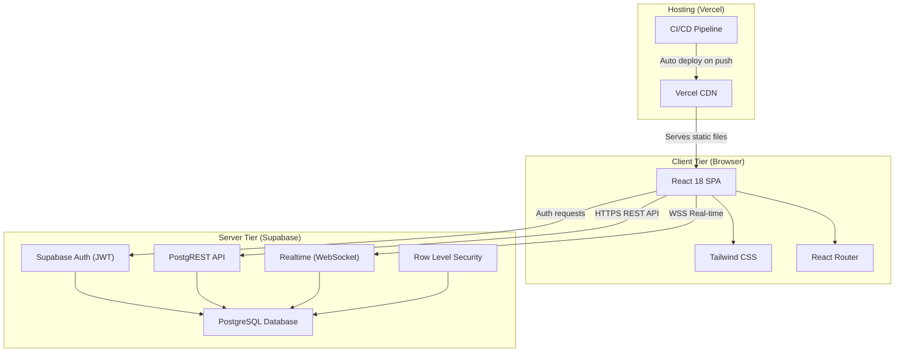
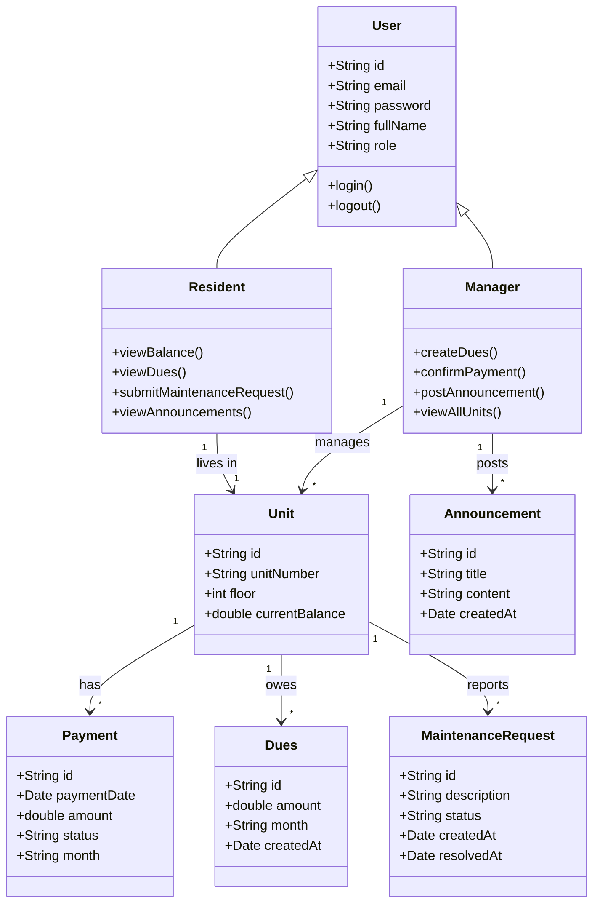
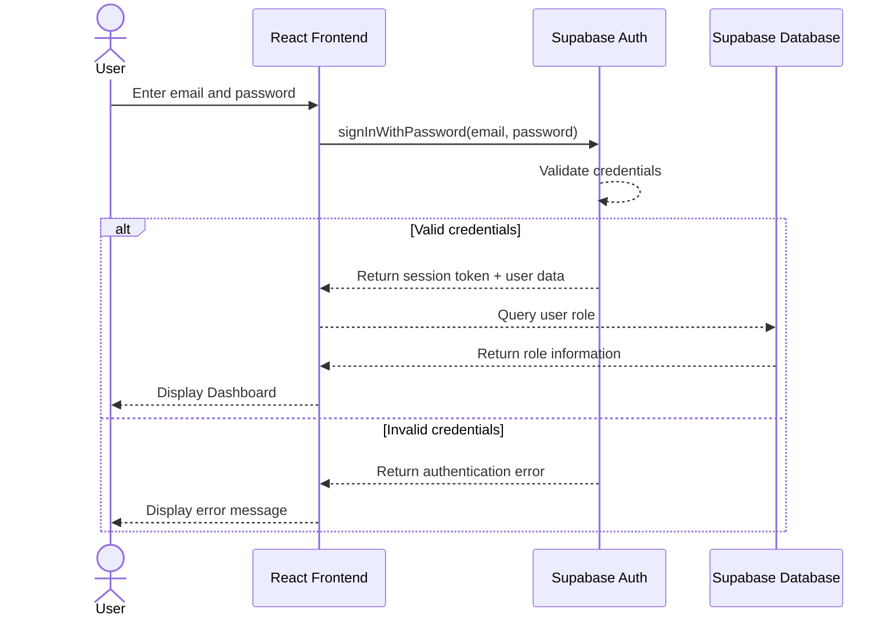
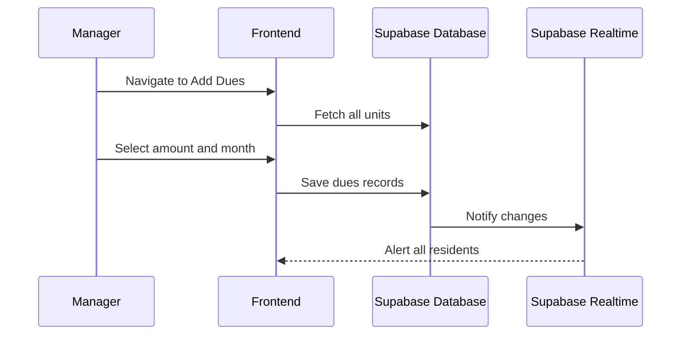
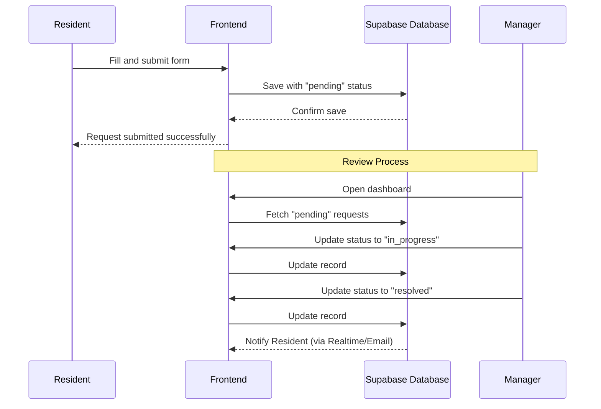
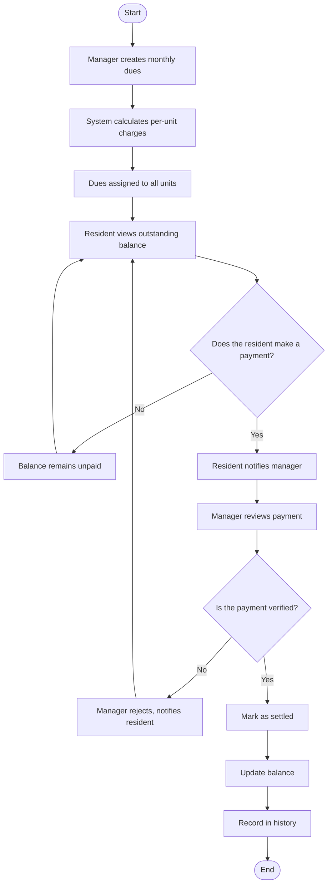
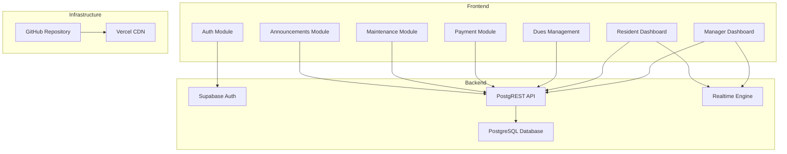
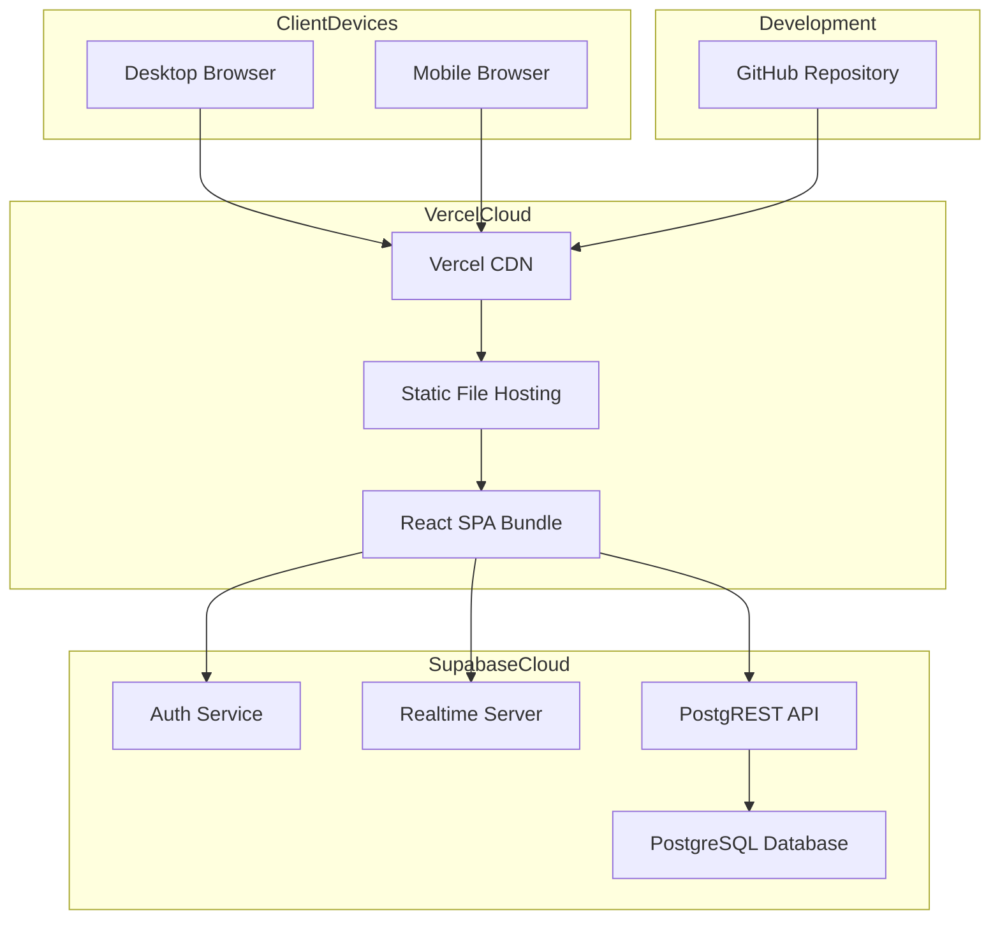
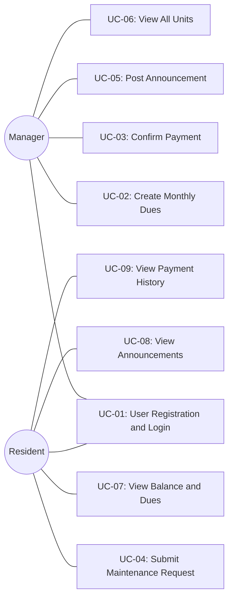

# HomeLink - Software Architecture Document

---

## Title Page

| | |
|---|---|
| **Project Name** | HomeLink - Property Management System |
| **Document Title** | Software Architecture Document (SAD) |
| **Version** | 1.0 |
| **Date** | April 2026 |
| **Course** | SWE332 - Software Architecture |
| **Architecture Model** | 4+1 View Model (Kruchten, 1995) |

### Team Members

| Name | Student ID | Responsibility |
|------|-----------|----------------|
| Bager Diren Karakoyun | 210513250 | Project Lead, README, Sections 1-3, Section 9 (Scenarios) |
| Abdalrahman Mazen Ahmad Nashbat | 230513079 | Section 5 - Logical Architecture (Class Diagram) |
| Deo Gratias Kipioka Mutipula | 220513571 | Section 6 - Process Architecture (Sequence + Activity Diagrams) |
| Maryama Said Mohamoud | 210513248 | Sections 7-8 - Development + Physical Architecture |
| Alawi Khaled Alhamed | 230513621 | Section 4 (Goals), Sections 10-11 (Size/Performance, Quality), Appendices |

---

## Table of Contents

1. [Scope](#1-scope)
2. [References](#2-references)
3. [Software Architecture](#3-software-architecture)
4. [Architectural Goals & Constraints](#4-architectural-goals--constraints)
5. [Logical Architecture](#5-logical-architecture)
6. [Process Architecture](#6-process-architecture)
7. [Development Architecture](#7-development-architecture)
8. [Physical Architecture](#8-physical-architecture)
9. [Scenarios](#9-scenarios)
10. [Size and Performance](#10-size-and-performance)
11. [Quality](#11-quality)
- [Appendices](#appendices)

---

## List of Figures

| Figure # | Title | Section |
|----------|-------|---------|
| Figure 3.1 | High-Level System Architecture Diagram | Section 3.3 |
| Figure 5.1 | Class Diagram | Section 5.2 |
| Figure 6.1 | Sequence Diagram - User Login | Section 6.2 |
| Figure 6.2 | Sequence Diagram - Add Dues | Section 6.3 |
| Figure 6.3 | Sequence Diagram - Maintenance Request | Section 6.4 |
| Figure 6.4 | Activity Diagram - Payment Flow | Section 6.5 |
| Figure 7.1 | Component Diagram | Section 7.3 |
| Figure 8.1 | Deployment Diagram | Section 8.1 |
| Figure 9.1 | Use Case Diagram | Section 9.1 |

---

## 1. Scope

### 1.1 Project Description

HomeLink is a web-based property management system designed to digitize and streamline the administrative operations of residential buildings. The platform serves as a centralized digital bridge between building managers and residents, replacing traditional paper-based or informal communication methods with a modern, real-time web application.

The system addresses the following core problems in residential building management:

- **Lack of transparency** in monthly dues and payment tracking
- **Inefficient communication** between managers and residents for announcements and requests
- **No centralized system** for submitting and tracking maintenance requests
- **Manual record-keeping** leading to errors in payment confirmations and balance calculations

HomeLink solves these problems by providing role-based dashboards for managers and residents, automated balance calculations, real-time data synchronization, and a complete audit trail for all financial transactions.

### 1.2 Document Purpose

This Software Architecture Document (SAD) describes the architecture of the HomeLink system using the **4+1 View Model** introduced by Philippe Kruchten (1995). The 4+1 model organizes the architecture into five concurrent views, each addressing a specific set of concerns:

| View | Purpose | Key Question |
|------|---------|-------------|
| **Logical Architecture** | Object-oriented decomposition into classes and entities | *What are the key abstractions?* |
| **Process Architecture** | Runtime behavior, concurrency, and synchronization | *How does the system behave at runtime?* |
| **Development Architecture** | Module structure, packages, and technology layers | *How is the code organized?* |
| **Physical Architecture** | Deployment topology and infrastructure mapping | *Where does the software run?* |
| **Scenarios (+1)** | Use cases that validate and connect all views | *What does the user actually do?* |

### 1.3 Target Audience

This document is intended for:

- **Developers** working on the HomeLink codebase who need to understand the system structure and make informed implementation decisions
- **Stakeholders** evaluating the technical approach, architectural decisions, and technology choices
- **Course Instructors** assessing the quality, completeness, and correctness of the architectural documentation
- **Maintainers** who will extend, modify, or debug the system in the future
- **New Team Members** who need to onboard quickly and understand the system's design rationale

### 1.4 Scope Boundaries

The following table clarifies what is included and excluded from the scope of HomeLink v1:

| In Scope | Out of Scope |
|----------|-------------|
| Single building management | Multi-building / multi-complex support |
| Manager and Resident roles | Admin super-user or third-party roles |
| Email/password authentication | OAuth, SSO, or social login providers |
| Monthly dues creation and tracking | Automatic payment gateway integration |
| Manual payment confirmation by manager | Online payment processing (credit card, bank transfer) |
| Maintenance request submission and tracking | Work order assignment to external contractors |
| Text-based announcements | Rich media announcements (images, videos, files) |
| Desktop and mobile responsive web app | Native iOS/Android mobile applications |

---

## 2. References

The following references were used in the preparation of this document and the development of the HomeLink system:

| # | Reference | Usage |
|---|-----------|-------|
| 1 | Kruchten, P.B. (1995). "The 4+1 View Model of Architecture." *IEEE Software*, 12(6), pp. 42-50. | Architecture documentation methodology |
| 2 | React Documentation - [https://react.dev/](https://react.dev/) | Frontend framework reference |
| 3 | Supabase Documentation - [https://supabase.com/docs](https://supabase.com/docs) | Backend, Auth, Realtime, and Database reference |
| 4 | Tailwind CSS Documentation - [https://tailwindcss.com/docs](https://tailwindcss.com/docs) | UI styling framework reference |
| 5 | Vercel Documentation - [https://vercel.com/docs](https://vercel.com/docs) | Deployment and hosting reference |
| 6 | PostgreSQL Documentation - [https://www.postgresql.org/docs/](https://www.postgresql.org/docs/) | Database engine reference |
| 7 | Vite Documentation - [https://vitejs.dev/guide/](https://vitejs.dev/guide/) | Build tool and development server reference |
| 8 | React Router Documentation - [https://reactrouter.com/](https://reactrouter.com/) | Client-side routing reference |

---

## 3. Software Architecture

### 3.1 Overview

HomeLink follows a **client-server architecture** where the frontend is a React-based Single Page Application (SPA) and the backend services are provided by Supabase, a Backend-as-a-Service (BaaS) platform. This architecture enables rapid development with minimal backend code, as Supabase automatically generates REST APIs from the PostgreSQL database schema, handles user authentication, and provides real-time data synchronization through WebSocket connections.

The key architectural decision to use Supabase as a BaaS instead of building a custom backend (e.g., Node.js + Express) was driven by:

- **Development speed** - Auto-generated APIs eliminate the need to write CRUD endpoints manually
- **Built-in authentication** - Supabase Auth provides JWT-based auth out of the box
- **Real-time capability** - WebSocket subscriptions are available without additional infrastructure
- **Row Level Security** - Database-level access control ensures data isolation between roles
- **Free tier availability** - Sufficient resources for the project's scale (v1)

### 3.2 The 4+1 View Model

This document organizes the HomeLink architecture using the **4+1 Architectural View Model** defined by Philippe Kruchten. Each view captures a different aspect of the system:

| View | Description | Key Diagrams | Section |
|------|-------------|-------------|---------|
| **Logical Architecture** | Describes the system's key abstractions as classes and entities, their attributes, methods, and relationships. Shows the object-oriented decomposition of the domain model. | Class Diagram | Section 5 |
| **Process Architecture** | Captures the system's dynamic behavior, including runtime interactions between components, concurrency, and synchronization. Shows how the system handles key workflows. | Sequence Diagrams, Activity Diagram | Section 6 |
| **Development Architecture** | Describes the static organization of the software in its development environment, including the module structure, package layout, and technology stack. | Component Diagram, Package Diagram | Section 7 |
| **Physical Architecture** | Maps software components to the physical infrastructure, showing deployment topology, network communication, and cloud services. | Deployment Diagram | Section 8 |
| **Scenarios (+1)** | Describes the most important use cases that drive and validate the architecture. Use cases connect all four views and demonstrate how they work together. | Use Case Diagram | Section 9 |

### 3.3 Architectural Style

HomeLink uses a **two-tier client-server architecture**:

*Figure 3.1 - High-Level System Architecture Diagram*



**Client Tier (Frontend):**

| Component | Technology | Responsibility |
|-----------|-----------|----------------|
| UI Framework | React 18 | Component-based user interface rendering |
| Styling | Tailwind CSS | Responsive, utility-first CSS styling |
| Routing | React Router v6 | Client-side page navigation (SPA) |
| Build Tool | Vite | Fast development server and production bundling |
| State Management | React Hooks (useState, useEffect) | Local component state and side effects |
| API Client | Supabase JS Client (`@supabase/supabase-js`) | Communication with Supabase backend |

**Server Tier (Backend - Supabase):**

| Service | Technology | Responsibility |
|---------|-----------|----------------|
| Database | PostgreSQL | Relational data storage for all entities |
| REST API | PostgREST (auto-generated) | CRUD operations on database tables |
| Authentication | Supabase Auth | User registration, login, JWT session management |
| Real-time | Supabase Realtime | WebSocket-based live data broadcasting |
| Access Control | Row Level Security (RLS) | Database-level role-based access policies |
| Storage | Supabase Storage | File storage (reserved for future use) |

**Hosting & Deployment:**

| Service | Technology | Responsibility |
|---------|-----------|----------------|
| Hosting | Vercel | Static site hosting with global CDN |
| CI/CD | Vercel + GitHub Integration | Automatic deployment on `git push` to main |
| Domain | Vercel Domains | Custom domain management and SSL certificates |

---

## 4. Architectural Goals & Constraints

### 4.1 Architectural Goals

The following architectural goals define the key qualities that the HomeLink system must exhibit. These goals were identified through stakeholder analysis and project requirements.

| Goal | Description |
|------|-------------|
| Usability | Simple, intuitive interface with minimal learning curve |
| Real-time Updates | Instant updates via WebSocket for all connected clients |
| Role-based Access | Strict separation between Manager and Resident at UI and data level |
| Maintainability | Clean, modular React component structure for easy extension |
| Availability | 24/7 access via any modern web browser on any device |

### 4.2 Constraints

The following constraints limit the architectural choices and must be respected throughout the design and implementation.

| Constraint | Detail |
|-----------|--------|
| Technology Stack | React + Tailwind CSS + Supabase + Vercel (free tier only) |
| Team Size | 5 developers with limited prior experience in the stack |
| Timeline | 6-week development cycle |
| Budget | Zero - only free-tier cloud services |
| Browser Support | Modern browsers only: Chrome, Firefox, Safari, Edge |
| Authentication | Supabase Auth with email/password only (no OAuth in v1) |

---

## 5. Logical Architecture

The Logical Architecture describes the system's object-oriented decomposition into classes and entities. It focuses on the key abstractions of the HomeLink domain and their structural relationships, answering the question: *"What are the key abstractions in the system?"*

### 5.1 Overview

The HomeLink domain model consists of 8 core entities that together capture all the state and behavior required to operate a residential building management system. The table below summarizes each entity, its attributes, and the methods it exposes:

| Entity | Attributes | Methods |
|--------|-----------|---------|
| **User** | id, email, password, fullName, role | login(), logout() |
| **Manager** | (inherits from User) | createDues(), confirmPayment(), postAnnouncement(), viewAllUnits() |
| **Resident** | (inherits from User) | viewBalance(), viewDues(), submitMaintenanceRequest(), viewAnnouncements() |
| **Unit** | id, unitNumber, floor, currentBalance | - |
| **Payment** | id, paymentDate, amount, status, month | - |
| **Dues** | id, amount, month, createdAt | - |
| **Announcement** | id, title, content, createdAt | - |
| **MaintenanceRequest** | id, description, status, createdAt, resolvedAt | - |

**Entity Descriptions:**

- **User** is the base abstraction for anyone who can authenticate into HomeLink. It stores identity (`id`, `email`, `fullName`), credentials (`password`), and a `role` discriminator that determines whether the user is a Manager or Resident. It exposes the authentication behaviors `login()` and `logout()` which are inherited by both subclasses.

- **Manager** is a specialization of User representing the building administrator. It adds administrative behaviors: `createDues()` to assign monthly charges to all units, `confirmPayment()` to approve resident payments, `postAnnouncement()` to broadcast messages to residents, and `viewAllUnits()` to access the global view of the building.

- **Resident** is a specialization of User representing a tenant living in a unit. It exposes tenant-facing behaviors: `viewBalance()` and `viewDues()` to check financial obligations, `submitMaintenanceRequest()` to report issues in the building, and `viewAnnouncements()` to read manager broadcasts.

- **Unit** represents a single apartment in the building. It is the central entity of the financial model: each unit has a `unitNumber`, a `floor`, and a `currentBalance` that is continuously recalculated as dues are created and payments are confirmed.

- **Payment** records a single financial transaction made by a resident toward a unit's balance. It captures the `paymentDate`, the `amount` paid, the `month` the payment is for, and a `status` that transitions through the values `pending` → `confirmed` / `rejected` depending on manager verification.

- **Dues** represents a monthly charge assigned to a unit. It stores the `amount` owed, the target `month`, and the `createdAt` timestamp when the manager generated the charge.

- **Announcement** represents a message broadcast by the manager to all residents. It has a `title`, free-form `content`, and a `createdAt` timestamp used for chronological sorting on the dashboard.

- **MaintenanceRequest** represents an issue reported by a resident about their unit or a shared area. It tracks a free-text `description`, a lifecycle `status` (`pending` → `in_progress` → `resolved`), a `createdAt` timestamp, and a `resolvedAt` timestamp that is set only when the manager marks the request as resolved.

### 5.2 Class Diagram

*Figure 5.1 - HomeLink Class Diagram*



The diagram above shows the 8 core domain entities of HomeLink, their attributes, methods, and the relationships that connect them. The model is centered around the `Unit` entity, which aggregates financial and maintenance data, while `User` is specialized into two subclasses (`Manager` and `Resident`) through inheritance.

### 5.3 Key Relationships

The table below summarizes the 8 relationships in the HomeLink class diagram, their UML type, and their meaning in the domain:

| Relationship | Type | Description |
|--------------|------|-------------|
| `User <\|-- Manager` | Inheritance | `Manager` is a specialization of `User` and inherits the authentication attributes and methods (`login()`, `logout()`). |
| `User <\|-- Resident` | Inheritance | `Resident` is a specialization of `User` and inherits the same authentication contract as `Manager`. |
| `Manager "1" --> "*" Unit` | Association | A single `Manager` manages all units in the building. This is a one-to-many read relationship used by `viewAllUnits()`. |
| `Resident "1" --> "1" Unit` | Association | Each `Resident` lives in exactly one `Unit`, and each `Unit` is occupied by one `Resident`. This link is used to filter dues and payments for the logged-in resident. |
| `Unit "1" --> "*" Payment` | Composition | Every `Unit` owns a collection of `Payment` records. Payments cannot exist without a parent unit, so their lifecycle is bound to the unit (composition semantics). |
| `Unit "1" --> "*" Dues` | Association | Each `Unit` is assigned a sequence of monthly `Dues` by the manager. Dues refer to a unit but are created independently in monthly batches, so the relationship is modeled as an association rather than composition. |
| `Unit "1" --> "*" MaintenanceRequest` | Composition | Every `Unit` can raise multiple `MaintenanceRequest` records over time. A request is meaningful only in the context of its unit, so the lifecycle is composed. |
| `Manager "1" --> "*" Announcement` | Association | The `Manager` is the sole author of `Announcement` entities. Announcements are broadcast to all residents and exist independently of any specific unit. |

**Relationship Semantics:**

- **Inheritance (`User <\|-- Manager`, `User <\|-- Resident`)** models the role-based authentication system. Both subclasses share the same identity and credential structure but override the behavior layer with role-specific operations. This allows the Supabase `users` table to be implemented as a single table with a `role` discriminator column.

- **Association** is used whenever two entities are connected conceptually but can exist independently. For example, a `Dues` record refers to a `Unit`, but dues are generated in monthly batches by the manager and are meaningful on their own as financial records. Similarly, `Announcement` entities are authored by a `Manager` but are not owned by any specific unit.

- **Composition** is used when a child entity's lifecycle is strictly tied to its parent. A `Payment` cannot exist without the `Unit` it is paying for, and a `MaintenanceRequest` is always raised against a specific unit. If a unit were ever removed, its payments and maintenance requests would logically be removed with it.

- **Multiplicities** capture the cardinality of each relationship: `"1" --> "*"` means one-to-many (e.g., one unit has many payments), while `"1" --> "1"` means one-to-one (each resident lives in exactly one unit). These multiplicities are enforced at the database level through foreign key constraints and Row Level Security policies.

---

## 6. Process Architecture

### 6.1. Key Processes
The system focuses on several key processes to ensure secure and real-time management

### 6.2. Sequence Diagram: User Login

### 6.3. Sequence Diagram: Add Dues


### 6.4. Sequence Diagram: Maintenance Request

### 6.5. Activity Diagram: Payment Flow

### 6.6. Concurrency and Real-time Behavior

Supabase Realtime uses WebSocket connections for live data updates.
When a manager updates dues or confirms a payment, all connected clients receive the update instantly.
The frontend subscribes to relevant table changes on component mount.
This ensures that no manual page refresh is needed, as the UI updates automatically.
This architecture guarantees data consistency across all active sessions.

---

## 7. Development Architecture

### 7.1 Technology Stack

| Layer            | Technology              | Purpose                              |
|------------------|------------------------|--------------------------------------|
| Frontend         | React 18               | Component-based UI development       |
| Styling          | Tailwind CSS           | Utility-first CSS framework          |
| Backend / DB     | Supabase (PostgreSQL)  | Data storage + auto REST API         |
| Authentication   | Supabase Auth          | User registration, login, sessions   |
| Real-time        | Supabase Realtime      | WebSocket-based live updates         |
| Hosting          | Vercel                 | Static site hosting with CI/CD       |
| Version Control  | GitHub                 | Source code + Git history            |
| Language         | JavaScript (ES6+)      | Core programming language            |


### 7.2 Package Structure

```
src/
 ├── components/
 │   ├── auth/
 │   │   ├── LoginForm.jsx
 │   │   ├── SignUpForm.jsx
 │   │   └── ProtectedRoute.jsx
 │   ├── dashboard/
 │   │   ├── ManagerDashboard.jsx
 │   │   ├── ResidentDashboard.jsx
 │   │   └── BalanceCard.jsx
 │   ├── dues/
 │   │   ├── AddDues.jsx
 │   │   └── DuesList.jsx
 │   ├── payments/
 │   │   ├── PaymentHistory.jsx
 │   │   └── PaymentConfirm.jsx
 │   ├── maintenance/
 │   │   ├── MaintenanceForm.jsx
 │   │   └── MaintenanceList.jsx
 │   └── announcements/
 │       ├── AnnouncementForm.jsx
 │       └── AnnouncementList.jsx
 ├── lib/
 │   └── supabaseClient.js
 ├── hooks/
 │   ├── useAuth.js
 │   └── useRealtime.js
 ├── pages/
 │   ├── Login.jsx
 │   ├── Signup.jsx
 │   ├── Dashboard.jsx
 │   └── NotFound.jsx
 ├── utils/
 │   └── calculations.js
 ├── App.jsx
 └── main.jsx
```
### 7.3 Component Diagram


### 7.4 Build and Deployment Pipeline

1. The developer creates a feature branch from the main branch.
2. The developer commits changes and pushes them to GitHub.
3. A Pull Request is opened for review.
4. After approval, the branch is merged into the main branch.
5. Vercel detects the update through the GitHub webhook and starts automatic deployment.
6. The production website is updated at the public URL within seconds.

---

## 8. Physical Architecture

### 8.1 Deployment Diagram


### 8.2 Deployment Topology

The system uses a fully cloud-based and serverless deployment architecture. The client tier consists of users accessing the application through desktop and mobile browsers. The frontend is delivered using Vercel's CDN, which ensures fast and reliable distribution of static assets. The backend tier is provided by Supabase running on AWS infrastructure, offering authentication, database, API, and real-time services. CI/CD is managed through GitHub, where code updates trigger automatic deployments to Vercel.

### 8.3 Network Communication

| Connection                   | Protocol         | Purpose                           |
|-----------------------------|------------------|-----------------------------------|
| Browser <-> Vercel         | HTTPS            | Serve static frontend assets      |
| Browser <-> Supabase API   | HTTPS (REST)     | CRUD operations on DB tables      |
| Browser <-> Supabase Realtime | WSS (WebSocket) | Live data updates to clients      |
| Browser <-> Supabase Auth  | HTTPS            | User registration and login       |
| GitHub <-> Vercel          | Webhook (HTTPS)  | Trigger automated deployments     |

---

## 9. Scenarios

The Scenarios view (+1) describes the key use cases that drive and validate the architecture. Each use case demonstrates how the system's actors interact with HomeLink to accomplish their goals. The scenarios serve as the connecting thread between all four architectural views, showing how the logical entities, runtime processes, development components, and physical infrastructure work together to deliver user-facing functionality.

### 9.1 Use Case Diagram

*Figure 9.1 - HomeLink Use Case Diagram*



### 9.2 Actors

| Actor | Description | Key Permissions |
|-------|-------------|-----------------|
| **Manager** | The building administrator responsible for creating dues, confirming payments, posting announcements, and managing all building units. Has full administrative access to the system. | Create dues, confirm/reject payments, post announcements, view all units and balances, manage maintenance requests |
| **Resident** | A tenant living in one of the building units. Can view their personal dues and balance, notify the manager of payments, submit maintenance requests, and view announcements. | View own balance/dues, notify payment, submit maintenance requests, view announcements |

### 9.3 Use Case Summary

| ID | Use Case | Primary Actor | Key Entity | Trigger |
|----|----------|--------------|------------|---------|
| UC-01 | User Registration and Login | Manager / Resident | User | User navigates to application URL |
| UC-02 | Manager Creates Monthly Dues | Manager | Dues, Unit | Manager needs to assign monthly charges |
| UC-03 | Manager Confirms Payment | Manager | Payment, Unit | Resident notifies manager of payment |
| UC-04 | Resident Submits Maintenance Request | Resident | MaintenanceRequest | Resident encounters a maintenance issue |
| UC-05 | Manager Posts Announcement | Manager | Announcement | Manager needs to communicate with residents |

### 9.4 Detailed Use Cases

#### UC-01: User Registration and Login

| Field | Detail |
|-------|--------|
| **Use Case ID** | UC-01 |
| **Use Case Name** | User Registration and Login |
| **Actor(s)** | Manager, Resident |
| **Precondition** | The user has access to the HomeLink application URL in a web browser. For login, the user must already have a registered account. |

**Main Flow:**
1. The user navigates to the HomeLink application URL.
2. The system displays the login page with email and password fields.
3. **For new users:** The user clicks "Sign Up" and enters their full name, email, password, and selects their role (Manager or Resident).
4. The system sends the registration data to Supabase Auth, which creates a new user account and inserts a record into the `users` table.
5. **For existing users:** The user enters their email and password and clicks "Login."
6. The system calls `supabase.auth.signInWithPassword()` with the provided credentials.
7. Supabase Auth validates the credentials and returns a JWT access token, refresh token, and user metadata.
8. The system queries the `users` table to retrieve the user's role (manager or resident).
9. The system redirects the user to the appropriate dashboard (Manager Dashboard or Resident Dashboard) based on their role.

**Alternative Flow:**
- **3a.** If the email is already registered, the system displays an error message: "This email is already in use."
- **7a.** If the credentials are invalid, Supabase Auth returns an error and the system displays: "Invalid email or password."

**Postcondition:** The user is authenticated and redirected to their role-specific dashboard. A valid JWT session token is stored in the browser's local storage.

---

#### UC-02: Manager Creates Monthly Dues

| Field | Detail |
|-------|--------|
| **Use Case ID** | UC-02 |
| **Use Case Name** | Manager Creates Monthly Dues |
| **Actor(s)** | Manager |
| **Precondition** | The manager is logged in and has access to the Manager Dashboard. Building units are already registered in the system. |

**Main Flow:**
1. The manager navigates to the "Add Dues" page from the dashboard.
2. The system fetches all registered units from the `units` table and displays them.
3. The manager enters the dues amount and selects the target month.
4. The system calculates the per-unit charges based on the entered amount.
5. The manager reviews the dues breakdown and clicks "Create Dues."
6. The system inserts dues records into the `dues` table for each unit via a POST request to the Supabase REST API.
7. Each unit's `currentBalance` in the `units` table is updated by adding the new dues amount.
8. Supabase Realtime broadcasts the INSERT event on the `dues` table to all connected resident clients.
9. The system displays a success confirmation to the manager.

**Alternative Flow:**
- **3a.** If dues for the selected month already exist, the system displays a warning: "Dues for this month have already been created."

**Postcondition:** Dues records are created for all units for the specified month. Unit balances are updated. All connected residents receive a real-time notification of the new dues.

---

#### UC-03: Manager Confirms Payment

| Field | Detail |
|-------|--------|
| **Use Case ID** | UC-03 |
| **Use Case Name** | Manager Confirms Payment |
| **Actor(s)** | Manager |
| **Precondition** | The manager is logged in. A resident has previously notified the manager of a payment, and the payment record exists in the system with status "pending." |

**Main Flow:**
1. The manager navigates to the "Payments" section on the Manager Dashboard.
2. The system fetches all payment records with status "pending" from the `payments` table and displays them.
3. The manager selects a specific payment to review.
4. The system shows the payment details: resident name, unit number, amount, date, and month.
5. The manager verifies the payment against actual bank records or receipts.
6. **If verified:** The manager clicks "Confirm Payment." The system sends a PATCH request to update the payment status to "confirmed" in the `payments` table.
7. The system recalculates the unit's `currentBalance` by subtracting the confirmed payment amount from the `units` table.
8. **If not verified:** The manager clicks "Reject Payment." The system updates the payment status to "rejected."
9. Supabase Realtime broadcasts the UPDATE event on the `payments` table to the affected resident client.

**Alternative Flow:**
- **6a.** If the payment amount exceeds the unit's current balance, the system displays a warning but still allows confirmation (overpayment creates a credit balance).

**Postcondition:** The payment status is updated to either "confirmed" or "rejected." The unit's balance is recalculated accordingly, and the resident is notified in real-time.

---

#### UC-04: Resident Submits Maintenance Request

| Field | Detail |
|-------|--------|
| **Use Case ID** | UC-04 |
| **Use Case Name** | Resident Submits Maintenance Request |
| **Actor(s)** | Resident |
| **Precondition** | The resident is logged in and has access to the Resident Dashboard. |

**Main Flow:**
1. The resident navigates to the "Maintenance" section on the Resident Dashboard.
2. The system displays the list of the resident's existing maintenance requests with their current statuses.
3. The resident clicks "New Request" to open the maintenance request form.
4. The resident enters a description of the maintenance issue (e.g., "Water leak in kitchen ceiling").
5. The resident clicks "Submit Request."
6. The system sends a POST request to insert a new record in the `maintenance_requests` table with status "pending", the resident's unit ID, and the current timestamp as `createdAt`.
7. The system displays a success confirmation with the request details and status "pending."
8. Supabase Realtime broadcasts the INSERT event to the manager's dashboard.
9. The manager later views the pending request and updates the status to "in_progress" when work begins.
10. When the issue is resolved, the manager updates the status to "resolved" and the `resolvedAt` timestamp is automatically recorded.

**Alternative Flow:**
- **4a.** If the description field is empty, the system displays a validation error: "Please describe the maintenance issue."

**Postcondition:** A maintenance request is created in the system with status "pending." The manager is notified and can manage the request lifecycle (pending → in_progress → resolved).

---

#### UC-05: Manager Posts Announcement

| Field | Detail |
|-------|--------|
| **Use Case ID** | UC-05 |
| **Use Case Name** | Manager Posts Announcement |
| **Actor(s)** | Manager |
| **Precondition** | The manager is logged in and has access to the Manager Dashboard. |

**Main Flow:**
1. The manager navigates to the "Announcements" section on the Manager Dashboard.
2. The system displays a list of all existing announcements, sorted by date (newest first).
3. The manager clicks "New Announcement" to open the announcement form.
4. The manager enters a title (e.g., "Water Maintenance Schedule") and the announcement content.
5. The manager clicks "Post Announcement."
6. The system sends a POST request to insert the announcement record into the `announcements` table with the manager's user ID and the current timestamp as `createdAt`.
7. Supabase Realtime broadcasts the INSERT event on the `announcements` table to all connected clients.
8. The system displays a success confirmation to the manager.
9. All logged-in residents see the new announcement appear on their dashboard in real-time without page refresh.

**Alternative Flow:**
- **4a.** If the title or content fields are empty, the system displays a validation error: "Title and content are required."

**Postcondition:** The announcement is stored in the database and visible to all residents. Connected residents receive the announcement in real-time without page refresh.

---

## 10. Size and Performance

### 10.1 System Size Estimates

| Metric | Estimate |
|--------|----------|
| Total Source Files | ~30-40 JSX/JS files |
| Lines of Code | ~3,000-5,000 |
| Database Tables | 6 tables |
| Expected Users (v1) | 1 building, ~20-50 residents, 1-3 managers |

### 10.2 Performance Targets

| Metric | Target |
|--------|--------|
| Page Load Time | < 2 seconds (initial load) |
| API Response Time | < 500ms per request |
| Real-time Latency | < 1 second |
| Concurrent Users | Up to 50 |
| Max Database Size | < 100MB (within free tier) |

### 10.3 Scalability

The current architecture supports a single building with a limited number of residents and managers. For future multi-building support, a `building_id` foreign key would need to be added to all relevant tables, along with a building selection screen at login. The Supabase free tier provides 500MB of database storage and supports up to 50,000 monthly active users, which is more than sufficient for the v1 scope. If the system needs to scale beyond a single building, upgrading to a paid Supabase plan and implementing database partitioning by building would be the recommended approach.

---

## 11. Quality

### 11.1 Quality Attributes

| Attribute | How It Is Achieved |
|-----------|-------------------|
| Reliability | Try-catch blocks, user-friendly error messages, managed infrastructure |
| Security | JWT tokens, Row Level Security (RLS), HTTPS, password hashing |
| Usability | Responsive Tailwind design, clear navigation, minimal clicks |
| Maintainability | Modular components, consistent naming, custom hooks |
| Portability | Responsive web design, no native dependencies, standard HTML/CSS/JS |

### 11.2 Security Measures

The following security measures are implemented to protect user data and ensure system integrity:

- **Authentication:** Supabase Auth with JWT tokens, automatic session refresh
- **Authorization:** Row Level Security (RLS) policies on every database table
- **Password Security:** Passwords hashed and salted by Supabase Auth, never stored in plaintext
- **Transport Security:** All connections use HTTPS or WSS (WebSocket Secure)

### 11.3 Testing Strategy

| Test Type | Approach |
|-----------|----------|
| Functional | Manual testing of all user flows before each milestone |
| Cross-browser | Verified on Chrome, Firefox, Safari, and Edge |
| Responsive | Tested on desktop (1920x1080), tablet (768x1024), mobile (375x812) |
| Security | Verify RLS policies by attempting cross-role data access |

---

## Appendices

### Acronyms and Abbreviations

| Acronym | Full Form |
|---------|-----------|
| SPA | Single Page Application |
| REST | Representational State Transfer |
| API | Application Programming Interface |
| CDN | Content Delivery Network |
| JWT | JSON Web Token |
| RLS | Row Level Security |
| CI/CD | Continuous Integration / Continuous Deployment |
| WSS | WebSocket Secure |
| CRUD | Create, Read, Update, Delete |
| BaaS | Backend as a Service |
| UI | User Interface |
| UX | User Experience |

### Definitions

| Term | Definition |
|------|-----------|
| Supabase | An open-source Backend-as-a-Service platform that provides a PostgreSQL database, authentication, real-time subscriptions, and auto-generated REST APIs. |
| Vercel | A cloud platform for frontend deployment that provides static hosting, serverless functions, and a global CDN with automatic CI/CD from GitHub. |
| React | A JavaScript library for building user interfaces using a component-based architecture, maintained by Meta. |
| Tailwind CSS | A utility-first CSS framework that provides low-level utility classes for building custom designs without writing custom CSS. |
| Row Level Security | A PostgreSQL feature that restricts which rows a user can access in a table based on policies defined using SQL expressions. |
| PostgREST | A standalone web server that automatically generates a RESTful API from a PostgreSQL database schema, used internally by Supabase. |
| WebSocket | A communication protocol that provides full-duplex communication channels over a single TCP connection, enabling real-time data transfer between client and server. |

### Design Principles

| Principle | Explanation |
|-----------|------------|
| Separation of Concerns | Each React component handles a single responsibility. UI logic, data fetching, and state management are separated into distinct layers (components, hooks, lib). |
| DRY (Don't Repeat Yourself) | Shared logic is extracted into custom hooks (`useAuth`, `useRealtime`) and utility functions (`calculations.js`) to avoid code duplication. |
| Mobile-First Design | The UI is designed for mobile screens first using Tailwind's responsive utilities, then enhanced for larger screens using breakpoint prefixes (`md:`, `lg:`). |
| Fail Gracefully | All API calls are wrapped in try-catch blocks with user-friendly error messages. The system degrades gracefully when real-time connections are unavailable. |
| Least Privilege | Each user role has the minimum permissions necessary. RLS policies ensure residents can only access their own data, and managers cannot access other buildings. |

---
