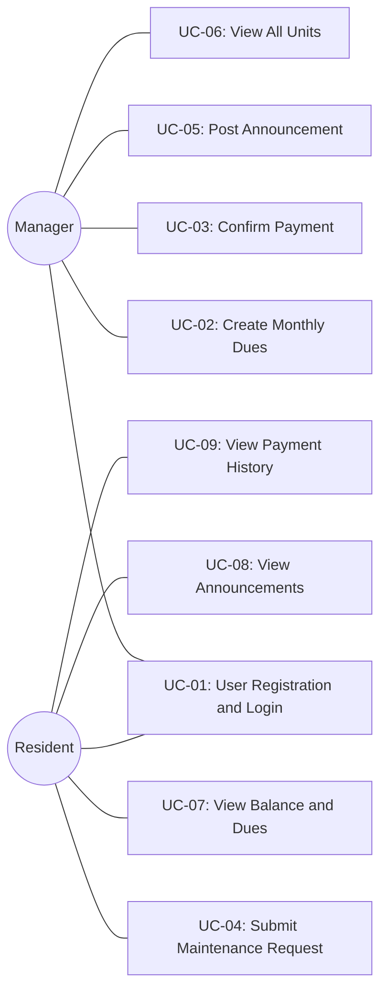

# HomeLink - Software Architecture Document

---

## Title Page

| | |
|---|---|
| **Project Name** | HomeLink - Property Management System |
| **Document Title** | Software Architecture Document (SAD) |
| **Version** | 1.0 |
| **Date** | April 2026 |
| **Course** | SWE332 - Software Architecture |
| **Architecture Model** | 4+1 View Model (Kruchten, 1995) |

### Team Members

| Name | Student ID | Responsibility |
|------|-----------|----------------|
| Bager Diren Karakoyun | 210513250 | Project Lead, README, Sections 1-3, Section 9 (Scenarios) |
| Abdalrahman Mazen Ahmad Nashbat | 230513079 | Section 5 - Logical View (Class Diagram) |
| Deo Gratias Kipioka Mutipula | 220513571 | Section 6 - Process View (Sequence + Activity Diagrams) |
| Maryama Said Mohamoud | 210513248 | Sections 7-8 - Development + Physical Views |
| Alawi Khaled Alhamed | 230513621 | Section 4 (Goals), Sections 10-11 (Size/Performance, Quality), Appendices |

---

## Change History

| Version | Date | Author | Description |
|---------|------|--------|-------------|
| 0.1 | 2026-04-05 | Bager Diren Karakoyun | Initial document structure, Title Page, TOC, List of Figures |
| 0.2 | 2026-04-05 | Bager Diren Karakoyun | Added Scope, References, Software Architecture overview |
| 0.3 | 2026-04-06 | Bager Diren Karakoyun | Added Scenarios section with Use Case Diagram and 5 use cases |

---

## Table of Contents

1. [Scope](#1-scope)
2. [References](#2-references)
3. [Software Architecture](#3-software-architecture)
4. [Architectural Goals and Constraints](#4-architectural-goals-and-constraints)
5. [Logical View](#5-logical-view)
6. [Process View](#6-process-view)
7. [Development View](#7-development-view)
8. [Physical View](#8-physical-view)
9. [Scenarios](#9-scenarios)
10. [Size and Performance](#10-size-and-performance)
11. [Quality](#11-quality)
12. [Appendices](#12-appendices)

---

## List of Figures

| Figure # | Title | Section |
|----------|-------|---------|
| Figure 9.1 | Use Case Diagram | Section 9.1 |
| Figure 5.1 | Class Diagram | Section 5.2 |
| Figure 6.1 | Sequence Diagram - User Login | Section 6.2 |
| Figure 6.2 | Sequence Diagram - Add Dues | Section 6.3 |
| Figure 6.3 | Sequence Diagram - Maintenance Request | Section 6.4 |
| Figure 6.4 | Activity Diagram - Payment Flow | Section 6.5 |
| Figure 7.1 | Component Diagram | Section 7.3 |
| Figure 8.1 | Deployment Diagram | Section 8.1 |

---

## 1. Scope

### 1.1 Project Description

HomeLink is a web-based property management system designed to digitize and streamline the administrative operations of residential buildings. The platform serves as a bridge between building managers and residents, providing tools for managing monthly dues, tracking payments, handling maintenance requests, and broadcasting announcements. By replacing traditional paper-based or informal communication methods, HomeLink aims to improve transparency, efficiency, and accountability in building management.

### 1.2 Document Purpose

This Software Architecture Document (SAD) describes the architecture of the HomeLink system using the **4+1 View Model** introduced by Philippe Kruchten (1995). The 4+1 model organizes the architecture into five concurrent views, each addressing a specific set of concerns:

- **Logical View** - The object-oriented decomposition of the system into key abstractions (classes and entities)
- **Process View** - The system's concurrency, synchronization, and runtime behavior
- **Development View** - The organization of the software modules, packages, and layers
- **Physical View** - The mapping of software components to hardware and cloud infrastructure
- **Scenarios (+1)** - Use cases that validate and illustrate the architecture

### 1.3 Target Audience

This document is intended for:

- **Developers** working on the HomeLink codebase who need to understand the system structure
- **Stakeholders** evaluating the technical approach and architectural decisions
- **Course Instructors** assessing the quality and completeness of the architectural documentation
- **Maintainers** who will extend or modify the system in the future

---

## 2. References

The following references were used in the preparation of this document and the development of the HomeLink system:

| # | Reference |
|---|-----------|
| 1 | Kruchten, P.B. (1995). "The 4+1 View Model of Architecture." *IEEE Software*, 12(6), pp. 42-50. |
| 2 | React Documentation - [https://react.dev/](https://react.dev/) |
| 3 | Supabase Documentation - [https://supabase.com/docs](https://supabase.com/docs) |
| 4 | Tailwind CSS Documentation - [https://tailwindcss.com/docs](https://tailwindcss.com/docs) |
| 5 | Vercel Documentation - [https://vercel.com/docs](https://vercel.com/docs) |

---

## 3. Software Architecture

### 3.1 Overview

HomeLink follows a **client-server architecture** where the frontend is a React-based Single Page Application (SPA) and the backend services are provided by Supabase, a Backend-as-a-Service (BaaS) platform. This architecture enables rapid development with minimal backend code, as Supabase automatically generates REST APIs from the PostgreSQL database schema, handles user authentication, and provides real-time data synchronization through WebSocket connections.

### 3.2 The 4+1 View Model

This document organizes the HomeLink architecture using the **4+1 Architectural View Model** defined by Philippe Kruchten. Each view captures a different aspect of the system:

| View | Description | Key Diagrams |
|------|-------------|-------------|
| **Logical View** | Describes the system's key abstractions as classes and entities, their attributes, methods, and relationships. Shows the object-oriented decomposition of the domain model. | Class Diagram |
| **Process View** | Captures the system's dynamic behavior, including runtime interactions between components, concurrency, and synchronization. Shows how the system handles key workflows. | Sequence Diagrams, Activity Diagram |
| **Development View** | Describes the static organization of the software in its development environment, including the module structure, package layout, and technology stack. | Component Diagram, Package Diagram |
| **Physical View** | Maps software components to the physical infrastructure, showing deployment topology, network communication, and cloud services. | Deployment Diagram |
| **Scenarios (+1)** | Describes the most important use cases that drive and validate the architecture. Use cases connect all four views and demonstrate how they work together. | Use Case Diagram |

### 3.3 Architectural Style

HomeLink uses a **two-tier client-server architecture**:

- **Client Tier (Frontend):** A React 18 SPA styled with Tailwind CSS, served as static files through Vercel CDN. The client handles all UI rendering, routing, and user interactions. It communicates with the backend exclusively through API calls and WebSocket subscriptions.

- **Server Tier (Backend):** Supabase provides all backend services including:
  - **PostgreSQL Database** - Relational data storage with Row Level Security (RLS)
  - **PostgREST API** - Auto-generated RESTful API for CRUD operations
  - **Supabase Auth** - User authentication with JWT token management
  - **Supabase Realtime** - WebSocket-based real-time data broadcasting

### 3.4 Communication Patterns

The system uses two primary communication patterns between the client and server:

1. **REST API (HTTPS):** All standard CRUD operations (creating dues, submitting maintenance requests, fetching announcements) are performed through synchronous REST API calls to the Supabase PostgREST endpoint.

2. **WebSocket (WSS):** Real-time updates are delivered through Supabase Realtime WebSocket subscriptions. When a manager creates new dues or confirms a payment, all connected clients receive the update instantly without requiring a page refresh. The frontend subscribes to relevant database table changes on component mount and automatically updates the UI when changes are detected.

---

<!-- Sections 4-8 will be added by other team members in their respective branches -->

## 9. Scenarios

The Scenarios view (+1) describes the key use cases that drive and validate the architecture. Each use case demonstrates how the system's actors interact with HomeLink to accomplish their goals.

### 9.1 Use Case Diagram

*Figure 9.1 - HomeLink Use Case Diagram*

### 9.2 Actors

| Actor | Description |
|-------|-------------|
| **Manager** | The building administrator responsible for creating dues, confirming payments, posting announcements, and managing all building units. Has full administrative access to the system. |
| **Resident** | A tenant living in one of the building units. Can view their dues and balance, notify the manager of payments, submit maintenance requests, and view announcements. |

### 9.3 Detailed Use Cases

#### UC-01: User Registration and Login

| Field | Detail |
|-------|--------|
| **Use Case ID** | UC-01 |
| **Use Case Name** | User Registration and Login |
| **Actor(s)** | Manager, Resident |
| **Precondition** | The user has access to the HomeLink application URL in a web browser. For login, the user must already have a registered account. |

**Main Flow:**
1. The user navigates to the HomeLink application URL.
2. The system displays the login page with email and password fields.
3. **For new users:** The user clicks "Sign Up" and enters their full name, email, password, and selects their role (Manager or Resident).
4. The system sends the registration data to Supabase Auth, which creates a new user account.
5. **For existing users:** The user enters their email and password and clicks "Login."
6. The system calls `signInWithPassword()` via Supabase Auth.
7. Supabase Auth validates the credentials and returns a JWT session token and user data.
8. The system queries the user's role from the database.
9. The system redirects the user to the appropriate dashboard (Manager Dashboard or Resident Dashboard) based on their role.

**Postcondition:** The user is authenticated and redirected to their role-specific dashboard. A valid JWT session token is stored in the browser.

---

#### UC-02: Manager Creates Monthly Dues

| Field | Detail |
|-------|--------|
| **Use Case ID** | UC-02 |
| **Use Case Name** | Manager Creates Monthly Dues |
| **Actor(s)** | Manager |
| **Precondition** | The manager is logged in and has access to the Manager Dashboard. Building units are already registered in the system. |

**Main Flow:**
1. The manager navigates to the "Add Dues" page from the dashboard.
2. The system fetches all registered units from the database and displays them.
3. The manager enters the dues amount and selects the target month.
4. The system calculates the per-unit charges based on the entered amount.
5. The manager reviews the dues breakdown and clicks "Create Dues."
6. The system inserts dues records into the database for each unit.
7. Supabase Realtime broadcasts the new dues to all connected resident clients.
8. The system displays a success confirmation to the manager.

**Postcondition:** Dues records are created for all units for the specified month. All connected residents receive a real-time notification of the new dues.

---

#### UC-03: Manager Confirms Payment

| Field | Detail |
|-------|--------|
| **Use Case ID** | UC-03 |
| **Use Case Name** | Manager Confirms Payment |
| **Actor(s)** | Manager |
| **Precondition** | The manager is logged in. A resident has previously notified the manager of a payment, and the payment record exists in the system with status "pending." |

**Main Flow:**
1. The manager navigates to the "Payments" section on the Manager Dashboard.
2. The system displays a list of pending payment notifications from residents.
3. The manager selects a specific payment to review.
4. The system shows the payment details: resident name, unit number, amount, date, and month.
5. The manager verifies the payment against actual bank records or receipts.
6. **If verified:** The manager clicks "Confirm Payment." The system updates the payment status to "confirmed" and recalculates the unit's outstanding balance.
7. **If not verified:** The manager clicks "Reject Payment." The system updates the payment status to "rejected" and notifies the resident.
8. Supabase Realtime broadcasts the updated payment status to the resident.

**Postcondition:** The payment status is updated to either "confirmed" or "rejected." The unit's balance is recalculated accordingly, and the resident is notified in real-time.

---

#### UC-04: Resident Submits Maintenance Request

| Field | Detail |
|-------|--------|
| **Use Case ID** | UC-04 |
| **Use Case Name** | Resident Submits Maintenance Request |
| **Actor(s)** | Resident |
| **Precondition** | The resident is logged in and has access to the Resident Dashboard. |

**Main Flow:**
1. The resident navigates to the "Maintenance" section on the Resident Dashboard.
2. The resident clicks "New Request" to open the maintenance request form.
3. The resident enters a description of the maintenance issue.
4. The resident clicks "Submit Request."
5. The system creates a new maintenance request record in the database with status "pending" and the current timestamp.
6. The system displays a success confirmation with the request details.
7. The manager later views the list of pending maintenance requests on the Manager Dashboard.
8. The manager updates the request status to "in_progress" when work begins.
9. The manager marks the request as "resolved" when the issue is fixed, and the `resolvedAt` timestamp is recorded.

**Postcondition:** A maintenance request is created in the system with status "pending." The manager can view and manage the request lifecycle (pending -> in_progress -> resolved).

---

#### UC-05: Manager Posts Announcement

| Field | Detail |
|-------|--------|
| **Use Case ID** | UC-05 |
| **Use Case Name** | Manager Posts Announcement |
| **Actor(s)** | Manager |
| **Precondition** | The manager is logged in and has access to the Manager Dashboard. |

**Main Flow:**
1. The manager navigates to the "Announcements" section on the Manager Dashboard.
2. The manager clicks "New Announcement" to open the announcement form.
3. The manager enters a title and the announcement content.
4. The manager clicks "Post Announcement."
5. The system inserts the announcement record into the database with the current timestamp.
6. Supabase Realtime broadcasts the new announcement to all connected clients.
7. The system displays a success confirmation to the manager.
8. All logged-in residents see the new announcement appear on their dashboard in real-time.

**Postcondition:** The announcement is stored in the database and visible to all residents. Connected residents receive the announcement in real-time without page refresh.

---
